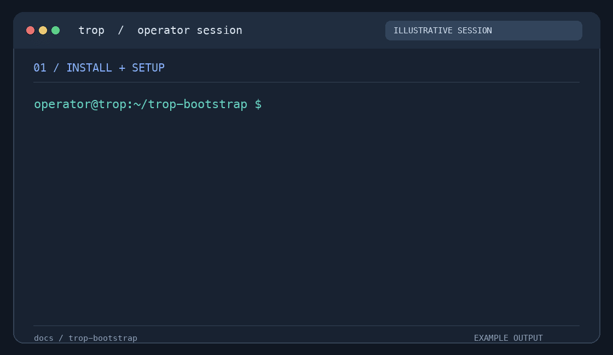
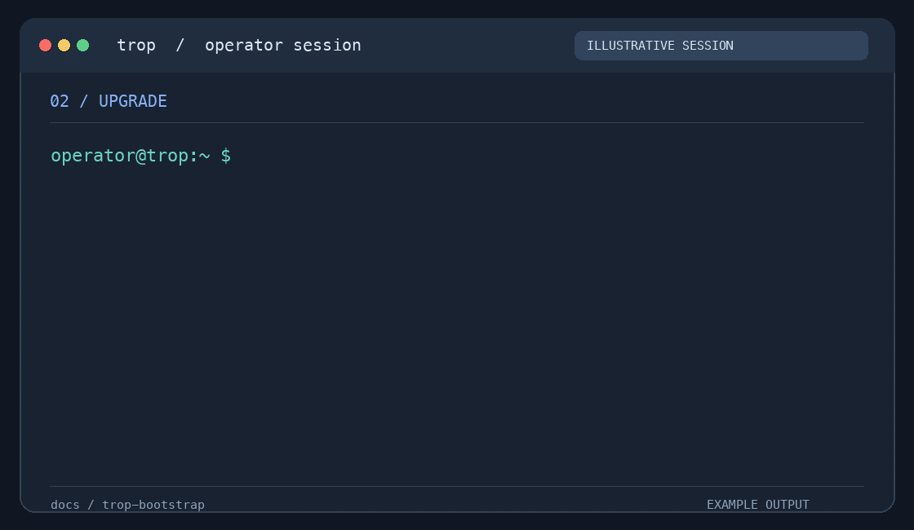
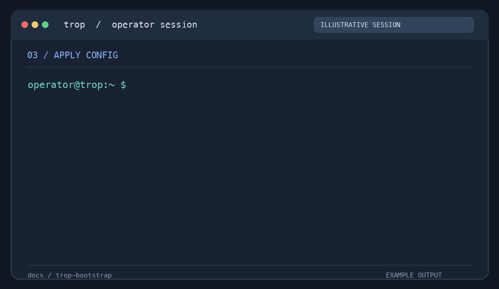
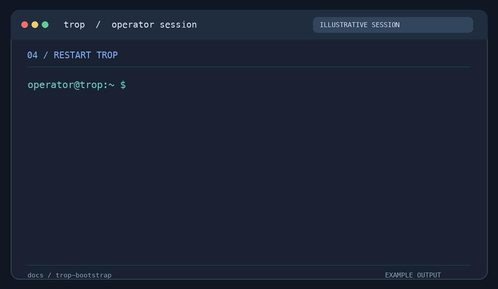

# TROP Standalone

Run on the Ubuntu host. Required: `curl`, `sudo`, internet access and a DefenceBay TROP token. Choose a [profile and host size](docs/requirements.md) first.

## Fresh install



```bash
mkdir -p "$HOME/trop-bootstrap" && cd "$HOME/trop-bootstrap"
curl -fL https://github.com/defencebay/trop-bootstrap/releases/latest/download/trop-bootstrap -o trop-bootstrap
chmod +x trop-bootstrap
./trop-bootstrap
```

```text
TROP token: [hidden input]
TROP release tag [latest stable]: [Enter]
Verified release-assets directory [/opt/trop/releases/<release>]: [Enter]
Choose an option [1]: 1
Installation profile: 3             # 1 Server; 2 Platform; 3 Platform + TOC
Setup mode: 1                       # Standard
TROP Server hostname: trop.example.com
LAN address for TROP: 192.168.20.10 # client-facing interface
Install global TROP operator tools on this server? true
```

```bash
readlink -f /opt/trop/current
trop status
trop health
trop-doctor install-validate
```

The wizard asks for host integrations separately; review its plan. `install-validate` prompts for administrator credentials. Configure DNS for other LAN clients separately.

```text
./trop-bootstrap                        public launcher, before install
/opt/trop/releases/<release>/           verified bundle after download
/etc/trop/zarf-config.yaml              private config after setup
/usr/local/bin/trop, trop-doctor        during deploy if INSTALL_OPERATOR_TOOLS=true
/opt/trop/current, trop-install         after a successful health gate
```

`trop` is optional, never a bootstrap prerequisite. Its presence during deploy does not prove the final health gate passed. On an older host, check `trop --help` and `trop-doctor version`; r70 bundles doctor 0.4.5 with `--release` and `config apply`.

## Upgrade



```bash
trop health
trop upgrade
readlink -f /opt/trop/current
trop health
```

The guided command fetches the launcher, prompts for the token and lists stable releases. It reuses `/etc/trop`. For an older helper, download `./trop-bootstrap` as above and run it on the installed host. For a specific tag: `./trop-bootstrap --release rNN-YYYYMMDD` or, on a newer helper, `trop upgrade --release rNN-YYYYMMDD`.

## Apply config



```bash
sudoedit /etc/trop/zarf-config.yaml
trop config apply
trop health
```

GlitchTip example: add these keys to the **existing** `package.deploy.set` mapping after upgrading to a compatible release. Use service-specific project DSNs.

```yaml
package:
  deploy:
    set:
      ENABLE_GLITCHTIP: "true"
      SENTRY_ENVIRONMENT: "your-environment"
      TROP_SERVER_SENTRY_DSN: "<server DSN>"
      TROP_SERVER_UI_SENTRY_DSN: "<server UI DSN>"
      TROP_CLOUD_SENTRY_DSN: "<cloud DSN>"
      TROP_TOC_SENTRY_DSN: "<TOC DSN>"
```

For SOPS installations, edit `/etc/trop/zarf-config.enc.yaml` with the site's key workflow. `config apply` performs the rollout.

## Restart



```bash
trop restart-all
trop health
```

`restart-all` restarts local k3s and waits for workloads. For a host reboot: `sudo reboot`.

## Debug and advanced

```bash
trop status
trop health
trop-doctor failing-pods
trop-doctor debug-bundle
sudo cat /opt/trop/operation-state
```

[Operator examples](docs/operator-examples.md) has manual deploy, resume, automation and custom `--dest` commands. The default managed bundle path is `/opt/trop/releases/<release>`; `/opt/trop/current` selects the healthy release. A custom `--dest` is a download/checkpoint directory, not a relocation of the managed install. Application data lives in k3s volumes. Keep the active bundle; upgrades are not data rollbacks.

Animations are illustrative. Regenerate with `python3 scripts/render-terminal-demos.py` after installing Pillow.
